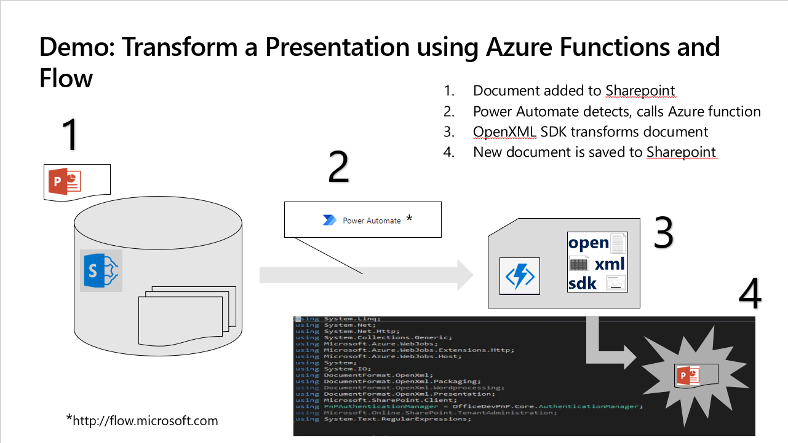
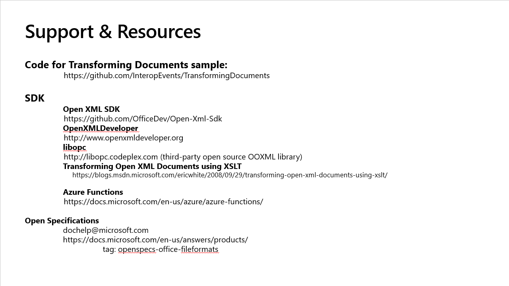

# TransformingDocuments

Code base for the **Automate Office Documents with Open XML SDK, Azure Functions, and Microsoft Power Automate** presentation and demo.

####Requirements:
- Microsoft Office account tenant for your team (available in event)
- Visual Studio (Community is fine)
NOTE: Install the Azure Development workload, for other requirements, follow [Develop Azure Functions using Visual Studio](https://docs.microsoft.com/en-us/azure/azure-functions/functions-develop-vs)
- (Optional) Git command line tools
- Web browser (Chrome or Edge are fine)
- [Open XML SDK](https://www.nuget.org/packages/DocumentFormat.OpenXml) from nuget.org (also in VS Nuget Package Manager)

